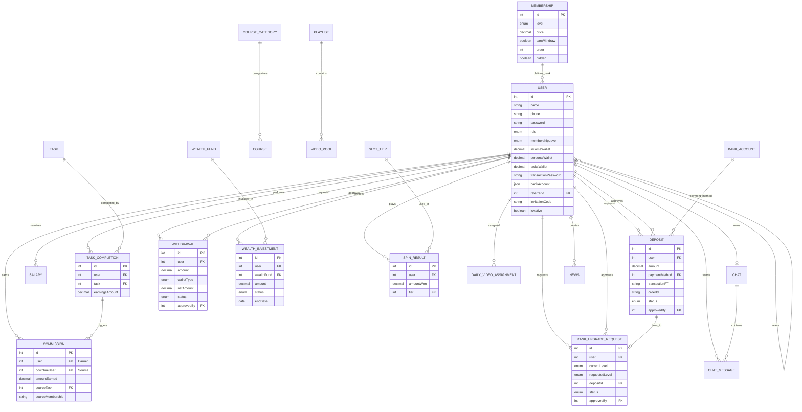

# FoxRiver Database Entity Relationship Diagram (ERD)

This diagram visualizes the structure and relationships of the FoxRiver database, illustrating how users, financial transactions, memberships, and content interact.

## Core Components

### 1. User & Membership
The central part of the system. Users are categorized by **Membership Levels** (Intern to Rank 10), which determine their earning potential and withdrawal rights. The `referrerId` creates a tree-like network for the commission system.

### 2. Financial Ecosystem
- **Wallets**: Users have three separate wallets (`Income`, `Personal`, `Tasks`).
- **Transactions**: `Deposits` and `Withdrawals` are the primary flows.
- **Incentives**: `Commissions` are generated by downline activity, and `Salaries` are paid based on recruitment thresholds.

### 3. Rank Upgrades
Upgrades can happen via direct deposit (linking a `Deposit` to a `RankUpgradeRequest`) or via Personal Wallet (creating a self-approved `RankUpgradeRequest` for history).

### 4. Earning Activities
- **Tasks**: Daily video watching recorded in `TaskCompletion`.
- **Wealth**: Fixed-term investments in `WealthFund`.
- **Games**: Slot machine interaction recorded in `SpinResult`.

### 5. Support & Content
- **Chat**: 1-on-1 support system.
- **Courses**: Educational content organized by category.
- **News**: System-wide announcements.
